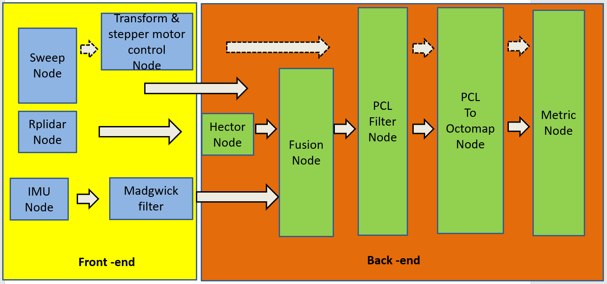
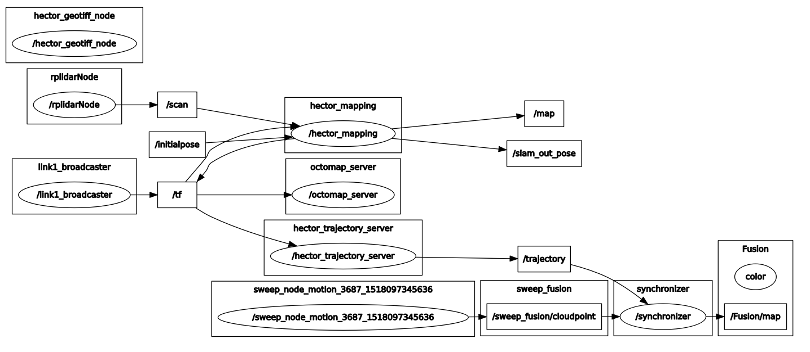
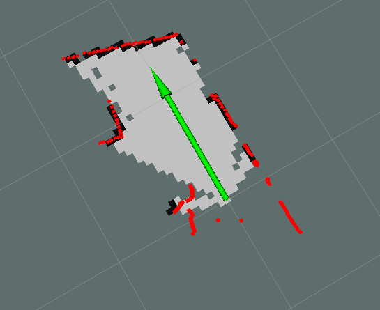

# Project: Portabal 3D Mapping device based on 2D Lidar
This repository is established for the master thesis program, to generate 3D mapping based on 2D Lidar, 2 modes can be chosen, mapping along motion & mapping from static locations. The generated map can be compared with the metric.

---
**A. Setup Work on Raspberry -pi**
---

All the codes raspberry pi is put in "~/slam_ws" wrokspace. The most convenient method, is to clone the whole system image on the Raspi's SD card, and back up it or burn it into additional SD card, this mirror image contains the built_in ros framework, and the i2c-tools, the i2c tool can installed via:
```
$ sudo apt-get install i2c-tools

```
The imu and stepper motor are connected via i2c, the address table can be checked via:
```
$ sudo i2cdetect -y 1

```
For more i2c details, please refer to [i2c on Raspberry](http://skpang.co.uk/blog/archives/575)[SMBus python](https://github.com/pimoroni/py-smbus), smbus is a python library for i2c protocol, to be used in my python coding.

---
**B. Setup Work on Laptop**
---

## 1.workspace at laptop
Catkin-tools is integrated into the ros framework, then how to build and init of workspace can be referred in [catkin tool](http://catkin-tools.readthedocs.io/en/latest/installing.html). Copy "catkin_ws" the whole folder into the home folder on your pc.
```
$ cd ~/catkin_ws/
$ catkin_make

```
 Run it the first time in your workspace, it will create a CMakeLists.txt link in your 'src' folder. Additionally, in your current directory you should now have a 'build' and 'devel' folder. Inside the 'devel' folder you can see that there are now several setup.*sh files. Sourcing any of these files will overlay this workspace on top of your environment. 
```
$ source ~/catkin_ws/devel/setup.bash

```
To make sure your workspace is properly overlayed by the setup script, make sure ROS_PACKAGE_PATH environment variable includes the directory you're in.
``` 
$ echo $ROS_PACKAGE_PATH /home/youruser/catkin_ws/src:/opt/ros/kinetic/share

```
## 2. Ros-kinetic Desktop-Full Version Install (Recommended):
this version includes all common tools on Ros, follow the instructions from [installation on Ubuntu](http://wiki.ros.org/kinetic/Installation/Ubuntu), the ubuntu version should be <b> Ubuntu 16.04.3 LTS (Xenial Xerus) 64 bit</b>.
## 3. PCL 1.7 Installation on laptop
this (PCL) is a standalone, large scale, open project for 2D/3D image and point cloud processing. [PCL installation](http://pointclouds.org/downloads/). Here two options can be offered,<br />
<b>3.1 Integration with ROS</b> 
PCL (verison 1.7) is the backbone of ROS to process the 3D pointcloud, The library is written in c++, the installed Ros-kinetic, by default includes already pcl-ros package. If you want to use PCL in you own project, follow the tutorials here, [PCL in your own project](http://pointclouds.org/documentation/tutorials/using_pcl_pcl_config.php#using-pcl-pcl-config), the ralative path "~/catkin_ws/src/fusion_octomap/CMakeLists.txt" is already modified according to the tutorial, so the workspace can be directly compiled.<br />
<b>3.2 PCL python</b> 
My code for Sweep lidar node is written in python, so the pcl python libarry should also be installed, in fact, python-pcl includes a subset of functionalites of full pcl tools, but that's enough.<br />
Some basic commands to install python-pcl are:
### 3.2.1 Install cython
```
$ sudo pip install cython

```
### 3.2.2 Build and Install pcl-python
```
$ cd ~/catkin_ws/src/python-pcl
$ python setup.py build
$ sudo python setup.py install

```
### 3.2.3 Install pcl-tools
```
$ sudo apt-get install pcl-tools

```
### 3.2.4 Documentation for pcl_helper.py
pcl_helper.py contains useful functions for working with point cloud data between ros_pcland pcl. The file itself is locating in "~/catkin_ws/src/fusion_octomap/scripts/pcl_helper.py", Functions used in my workspace includes the two functions:
```
ros_to_pcl(sensor_msgs/PointCloud2)

```
ros_to_pcl converts sensor_msgs/PointCloud2 to XYZRGB Point Cloud<br />
```
pcl_to_ros(pcl.PointCloud_PointXYZRGB)

```
pcl_to_ros converts XYZRGB Point Cloud to sensor_msgs/PointCloud2 <br />
## 4. Octomap installation on laptop
<b>4.1 Integration with ROS</b> The command below will install the octomap package,
```
$ sudo apt-get install ros-kinetic-octomap

```
<b>4.2 stand-alone library</b> To install OctoMap as stand-alone libraries with no ROS dependencies (so the package can also be used in a non-ROS setting). This work is already done for workspace, normally the CMakeLists.txt in your own package folder should be modified as below:
```
find_package(octomap REQUIRED)
include_directories(${OCTOMAP_INCLUDE_DIRS})
target_link_libraries(${OCTOMAP_LIBRARIES})
(Add link_directories(${OCTOMAP_LIBRARY_DIRS}) only if required - usually it's not needed).

```
package.xml is supposed to be modified accordingly, add the following part into your package.xml:
```
<build_depend>octomap</build_depend>
<run_depend>octomap</run_depend>

```
This work is done already for my own package "fusion_octomap" in "~/catkin_ws/src/fusion_octomap", the CMakeLists.txt and package.xml can be used as reference if further self-defined package is integrated into the whole work space.

## 5. Visualization software on laptop
<b>a. pcl_viewer</b> <br />
pcl-viewer is a software to visualize pointcloud on your pc, installation commands:
```
$ sudo add-apt-repository ppa:v-launchpad-jochen-sprickerhof-de/pcl
$ sudo apt-get update
$ sudo apt-get install libpcl-all

```
The pointcloud is dumped into pcd file, some pcd files, generated from four types of maps are locating in "~/catkin_ws/src/fusion_octomap/*.pcd", to open a pcd file in pcl_viewer, the command is called as following, here, e.g. we want to open the fused_pcd.pcd file:
```
$ cd ~/catkin_ws/src/fusion_octomap/point_cloud/fused_pcd.pcd
$ pcl_viewer fused_pcd.pcd

```
The default background color is black, to change it to white, the command should be appended with the inputs:
```
$ pcl_viewer downsampling_filter.pcd  -bc 1,1,1 

```
To see more information about how to use pcl_viewer, you can press "h" in the opened viewer window.<br />
<b>b. octovis</b> <br />
octovis is available in the ros-kinetic-octomap debian package. As an alternative, you can download the package yourself from [octomap](http://octomap.github.io) and compile it with the library stand-alone or against a locally installed octomap library. To install octovis on Ubuntu using the pre-built packages, run command below:
```
$ sudo apt-get install ros-kinetic-octovis

```
The octomap is dumped into "*.ot" or "*.bt" file, these files are locating in "~/catkin_ws/src/fusion_octomap/binary_maps/*.ot", The depth of octree, and the color can be modified in tool bar at right and at top of the octovis window, to open a *.ot file in octovis, the command is called as following, here, e.g., we want to open the single-pose.ot file,:
```
$ cd ~/catkin_ws/src/fusion_octomap/binary_maps/single-pose.ot
$ octovis single-pose.ot

```
---
**C. Run Ros Nodes**
---

## 1. Set up Ros network
The network should be set-up properly to manage the nodes running on different machines,<br />
1.1 Make sure the raspberry and your PC, both are connected to a same wireless local network, all the machines are supposed to be connected to HUAWEI-681D, portable WIFI, on raspberry this should be checked via "ifconfig", because it may connect to other signals nearby. <br />
1.2 Change the ip address, the ip address file is locating in "etc/hosts" on ubuntu system directory. open the hosts with root permission and copy the ip address of your pc and raspberry into hosts files, e.g., format is ip address followed by hostname <br />:
```
192.168.8.102	desktop

```
This is aready done on Rasp pi's hosts file, so only the value needs to be modified.<br />
1.3 Export your ip address into the terminal, where you will launch the node later, this should be done both for raspberry and you pc, you can use ssh to remotely log onto the raspberry and do the settings remotely.<br />
```
$ export ROS_MASTER_URI=http://192.168.8.--:11311
$ export ROS_IP=http://192.168.8.*:11311

```
ROS_MASTER_URI is a required setting that tells nodes where they can locate the master. It should be set to the URI of the master node. This ROS_MASTER_URI is supposed to be same on different machines, and set to the IP of the machine, on which you will run roscore node. Special care should be taken when using localhost, as that can lead to unintended behaviors with remotely launched nodes. The second command ROS_IP is the real IP address of the machine,  if the static ip address is used, then for convenience you can also copy the commands above into your ~/.bashrc file and then source with it starting the Ros nodes.
```
$ echo 'export ROS_MASTER_URI=http://192.168.8.--:11311' >> ~/.bashrc 
$ echo 'export ROS_IP=http://192.168.8.--:11311' >> ~/.bashrc 

```
1.4. Export your ip address into the terminal where you will launch the node later<br />
1.5. Call the roscore on the machine, whose IP address is consistent with ROS_MASTER_URI. The terminal shouldn't be terminated during the whole working process, because it is responsible for communication between different nodes.<br /> 
```
$ roscore

```
1.6. Run Ros nodes in the workspace, each node is an individual process, there are two way for running of these nodes, one is through launch file to launch a batch of nodes sequentially,<br />
 ```
$ roslaunch package-name launchfile-name.launch

```
The name can be through "TAB" to be completed, or you can also run the node separately in each terminal,<br />
 ```
$ rosrun package-name nodename

```
## 2. Change USB permission & port number
cd to the "/dev/ttyUSB*", then change its permission,
 ```
$ sudo chmod 666 /dev/ttyUSB*

 ```
the USB port should be consistent with the sensor's real port number, on Raspberry PI, the real port number can be found under folder "/dev", both Lidars appear as ttyUSB*, for Rplidar, this number can be changed in the launch file, locating in "~/slam_ws/src/rplidar_ros/launch/perception.launch".
 ```
<launch>
  <node name="rplidarNode"          pkg="rplidar_ros"  type="rplidarNode" output="screen">
  <param name="serial_port"         type="string" value="/dev/ttyUSB2"/>  
  <param name="serial_baudrate"     type="int"    value="115200"/>
  <param name="frame_id"            type="string" value="laser"/>
  <param name="inverted"            type="bool"   value="false"/>
  <param name="angle_compensate"    type="bool"   value="true"/>
  </node>

  <!--node name="Imu" pkg="mems_10dof" type="imu.py" output="screen"/-->
</launch>

```
Change the value of the name "serial_port" to the real number, for sweep this can be configured inside the python codes
 ```
 with Sweep('/dev/ttyUSB0') as sweep:
               # Create a scanner object
               time.sleep(1.0)
             
               scanner = Scanner( \
               device=sweep, base=base, settings=settings, exporter=exporter)

               # Setup the scanner
               scanner.setup()

               # Perform the scan
               scanner.perform_scan()
```
The value behind Sweep is the port number, This parameter of Sweep Lidar should be changed according the real number, 
---
**D. Map Generation along Motion**
---


<br />&emsp; &emsp;  &emsp;  &emsp; &emsp; &emsp;  &emsp;  &emsp; &emsp; &emsp;  &emsp;  &emsp;&emsp; &emsp;  &emsp;  &emsp;Overall nodes flow<br />
the bottom part in figure "overall nodes flow", connected by arrows with solid lines, is the part for the map generation along motion,
the following work is also organized sequentially, from nodes on Raspberry, until to the nodes on laptop, the convert from pcl to octomap is done offline, because filter used for reference map is written in python, which is not consisten with the pcl in c++, so the filter is done offline, using alternative approach.

<br />&emsp; &emsp;  &emsp;  &emsp; &emsp; &emsp;  &emsp;  &emsp; &emsp; &emsp;  &emsp;  &emsp;&emsp; &emsp;  &emsp;  &emsp;Scanning along motion<br />

## Nodes on Raspberry
1. Setup IP  and MASTER_URI for the node, which will be launched in terminal, same work as to reference map:
```
$ export ROS_MASTER_URI=http://192.168.8.--:11311
$ export ROS_IP=http://192.168.8.*:11311
$ source ~/slam_ws/devel/setup.bash

```
Then cd to the repository and activate the sweep node for publishment of the scan continuously:
```
$ cd  ~/slam_ws/src/scanner_3d_scanner_3d
$ python sweep_fusion.py

```
2. Open another terminal, do the same setting steps, launch the Rplidar node, the port number should be checked before launch.
```
$ cd  ~/slam_ws/src/rplidar_ros
$ roslaunch rplidar_ros perception.launch

```
Then the Rpliar is supposed to be rotating. Here the imu node in line 10 is commented out, in perception.launch file,
```
$   <!--node name="Imu" pkg="mems_10dof" type="imu.py" output="screen"/-->

```
The "!-- ","--" are appended to the start and end of the node, to comment out the node, so the node will not be executed, here the rasp-pi is packed into a plastic bracket, and wires to connect imu don't pass through it, so imu node is not activated in motion mode. But in registered rosbag files, the imu data is recorded into two bagfiles, during experiment. The two rapsberry boards were utilized in experiment. imu file is locating in "~/slam_ws/src/mems_10dof/scripts/imu.py", the oublished topic from imu is "imu/data", which can be visualized in rviz with imu class on left panel of rviz, just select the topic in the class accordingly.

## Nodes on laptop
1. Open a terminal on laptop. repeat the exporting process, or if you copy already the correct paths into "~/.bashrc" file, just source bash file at rootthe bashrc file.
```
$ source ~/catkin_ws/devel/setup.bash
$ cd ~/catkin_ws/src/fusion_octomap
$ roslaunch fusio_octomap view_hectorSlam.launch

```
Then the rviz and hectorSlam are supposed to be lauched, normally it takes several seconds beforel the grid map appears, youn will see a green arrow pointing to the direction, which is oppostite to the front side of the Rplidar container, with bule tape marked on it.

<br />&emsp; &emsp;  &emsp;  &emsp; &emsp; &emsp;  &emsp;  &emsp; &emsp; &emsp;  &emsp;  &emsp;&emsp; &emsp;  &emsp;  &emsp;Start-up Snapshot<br />
So Hectop will update the map with the scan measurements.<br />
2. Open a terminal on laptop. repeat the exporting process, then run the node to fuse topics together.
```
$ rosrun fusio_octomap synchronizer

```
3. Until the end of motion, stop the sychronizer node via "ctl-c", then the fused points from multiple scans will be filtered, and then dumped into the fused_pcd.pcd file locating in "~/catkin_ws/src/fusion_octomap/point_cloud", then open the "pcd_to_pcl.launch" file, in "~/catkin_ws/src/fusion_octomap/launch"
```
  <node pkg="pcl_ros" type="pcd_to_pointcloud" name="spawn_pcd_to_pcl" output="screen" args    
  ="~/catkin_ws/src/fusion_octomap/point_cloud/fused_pcd.pcd 0.1" >
  
```
The pcd file name is supposed to be changed according to the file name.
```
$ cd ~/catkin_ws/src/fusion_octomap/launch
$ roslaunch fusion_octomap pcd_to_pcl.launch
  
```
4. launch the octomap node. Here the rviz node in line 21 should be commented out, view_octomap.launch locating in "~/catkin_ws/src/fusion_octomap/launch"
```
$ roslaunch fusion_octomap view_octomap.launch

```
5. Open another terminal and repeat the exporting and source steps, convert the pointcloud to octomap, 
```
$ rosrun octomap_server octomap_saver motion-mapfile.ot

```

---
**E. Rosbag Files Play-back**
---

All the ropics from different sensors along with the transforms between different frames are recorded into the bag files ,[rosbag command](http://wiki.ros.org/rosbag/Commandline), play-back bagfiles can be launched via commands below:
```
$ cd /bagfiles
$ rosbag play bagfilename.bag

```
Then the topics and transforms will be published, and the synchronizer node can run to verify the perfomance of the algorithm. play rate can be speeded up via "$ rosbag play -r 10 recorded1.bag", "r" is the rate. <b>!!! There are two types of bagfiles</b>, bag files with "moton" in name is for scanning along motion, with "static" in name is for scanning at static locations. The bag files recorded along motion has two sub-types, one is with recording of imu data, the others are without imu recording. "big-box" means the relative distance between sweep Lidar and Rplidar is different, the default distance is for small box, the bagfiles were recorded with different distance offsets in experiment, offset should be changed in node "synchronizer", which is locating in "~/catkin_ws/src/fusion_octomap/src",  change the values in line63 and line 64 according to the comments there. Then recompile the whole workspace before running of the nodes.

---
**F. Metric**
---

The "compare_octrees.cpp" is for metric evaluation over two maps, locationg in locating in "/catkin_ws/src/fusion_octomap/src", the ot files after convert by octomap-server node is by default put in devel folder, it should be moved into the repository: "/catkin_ws/src/fusion_octomap/binary_maps". Then the path and file name should be added into the path variable within the "compare_octrees.cpp", from line 28 to l29, then recompile the whole work space, finally run metric node in another terminal,
```
$ rosrun fusion_octomap metricNode

```
"metric logodds", "metric Iou", "metric correlation", will be printed in the last three rows, the three values of these three metrics will be printed out in this order.

